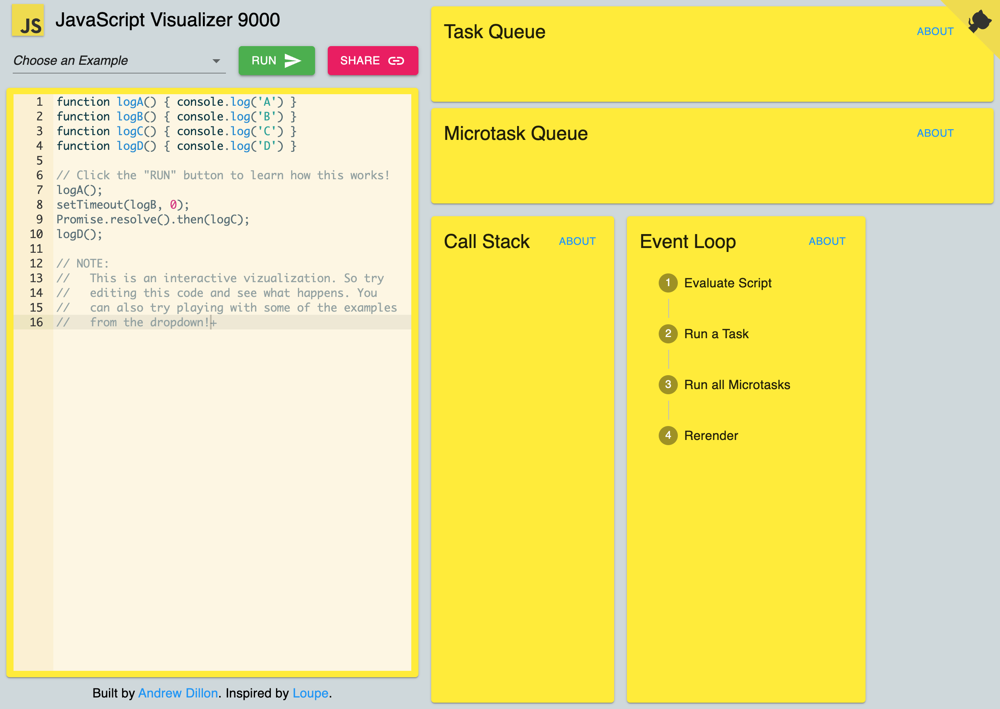

<h1 align="center">Bienvenue sur asynchrone 👋</h1>
<p>
  <a href="https://twitter.com/Gorski_anthony" target="_blank">
    
  </a>
</p>

## Et l'asynchrone, c'est quoi ?

### Les promesses

> Je te **promets** d'essayer de le faire. Je te tiens au jus quand j'aurai **terminé**. Et si je rencontre un **problème**, je te le dis aussitôt et j'arrête tout.

Ceci est une simple illustration des promesses JavaScript.

Une promesse est utilisée pour gérer le résultat asynchrone d'une opération.

JavaScript est conçu pour ne pas attendre qu'un bloc de code asynchrone s'exécute complètement avant que d'autres parties synchrones du code puissent s'exécuter.

Par exemple, lorsque vous faites des demandes d'API aux serveurs, on a aucune idée de si ces serveurs sont hors ligne ou en ligne, ni combien de temps, il faut pour traiter la demande du serveur.

Avec `Promises`, nous pouvons différer l'exécution d'un bloc de code jusqu'à ce qu'une requête **asynchrone** soit terminée. De cette façon, d'autres opérations peuvent continuer à fonctionner sans interruption.

Les promesses ont trois états :

-   `Pending` ( En attente ) : il s'agit de l'état initial de la promesse avant le début d'une opération
-   `Resolved` ( Réalisé ): ça signifie que l'opération spécifiée a été terminée
-   `Rejected` ( Rejeté ): l'opération ne s'est pas terminée ; une erreur est généralement levée


## **Utilisation des promesses**

Utiliser une promesse qui a été créée est relativement simple ; nous enchaînons `.then()` et `.catch()` à notre promesse comme ceci:

```jsx
date.then(function (done) {
	// sera déclenché par l'appel du callback resolve()
}).catch(function (error) {
	// sera déclenché par l'appel du callback reject()
});
```

En utilisant la `Promise` que nous avons créée ci-dessus, allons plus loin:

```jsx
const myDate = function () {
	date.then(function (done) {
		console.log("On a un rendez vous ! Whaouuuu");
		console.log(done);
	}).catch(function (error) {
		console.log(error.message);
	});
};

myDate();
```

`.then()` reçoit une fonction avec un argument qui est la valeur de résolution de notre promesse.

`.catch()` renvoie la valeur de rejet de notre promesse.

Remarque : les promesses sont asynchrones, les fonctions qui contiennent des promesses sont placées dans une file d'attente de micro-tâches et exécutées lorsque les autres opérations synchrones sont terminées.

_En gros, la promesse n’existe pas tant que l’on n'a pas appelé la fonction synchrone myDate_



Source : [ici](https://www.jsv9000.app/)

## **Créer une promesse**

L'objet Promise est créé à l'aide du mot-clé `new` et contient la promesse.

Il s'agit d'une fonction exécuteur de **callback**, en l'occurrence `resolve` et `reject`.

Chacun de ces **callback** renvoie une valeur, le `reject` renvoyant un objet `Error`.

[Plus d’info ici](https://developer.mozilla.org/fr/docs/Web/JavaScript/Reference/Global_Objects/Promise/reject)

```jsx
const promise = new Promise(function (resolve, reject) {
	// Description de la promesse
});

const promise = () =>
	new Promise((res, rej) => {
		// Description de la promesse
	});
```

Créons une `Promise`!

```jsx
const date = new Promise(function (resolve, reject) {
	//Définissons une variable de test permettant de passer soit dans le resolve soit dans le reject
	const tournoi = true;
	if (tournoi) {
		const dateDetails = {
			name: "Tournoi d'échecs",
			location: "Marseille",
			table: 1,
		};

		resolve(dateDetails);
	} else {
		reject(new Error("Tournoi annulé !"));
	}
});
```

Si `tournoi` vaut `true`, la promesse sera résolue et le retour des données représentera `dateDetails`, sinon on retourne un objet `Error` avec le message :

> Tournoi annulé !

Puisque la valeur `tournoi` est `true`, on appelle `myDate()` et on verra écrit dans la console :

```jsx
{
  name:     "Tournoi d'échecs",
  location: "Marseille",
  table:    1
}
```

## **Chaîner les promesses**

Parfois, nous pouvons avoir besoin d'exécuter deux ou plusieurs opérations asynchrones en fonction du résultat des promesses précédentes. Dans ce cas, les promesses sont enchaînées. Toujours en utilisant notre promesse créée, demandons à notre mère de nous amener au tournoi si nous avons une location.

Nous créons donc une autre `Promise`:

```jsx
const callMyMom = function (dateDetails) {
	return new Promise(function (resolve, reject) {
		const message = `Vite maman ! Amène-moi à ${dateDetails.location}, j'ai un tournoi !`;
		resolve(message);
	});
};
```

Cette `Promise` peut être raccourcie comme ceci :

```jsx
const callMyMom = function (dateDetails) {
	const message = `Vite maman ! Amène-moi à ${dateDetails.location}, j'ai un tournoi !`;
	return Promise.resolve(message);
};
```

On enchaîne cette promesse à notre fonction date() écrite précédemment:

```jsx
const myDate = function () {
	date.then((res) => {
		console.log(res);
		return res;
	})
		.then(callMyMom)
		.then((res) => console.log(res))
		.catch(function (error) {
			console.log(error.message);
		});
};
myDate();
```

Et comme `tournoi` vaut toujours `true`, on obtient :

`Vite maman ! Amène-moi à Marseille, j'ai un tournoi !`

Une fois que la promesse `callMyMom` est enchaînée avec `.then()`, le `.then()` suivant utilise les données de la précédente et ainsi de suite.

# **Async and Await**

Une fonction asynchrone est une modification de la syntaxe utilisée dans l'écriture de promesses. On peut l'appeler `syntactic sugar over promises`, littéralement un sucre syntaxique sur les promesses. Cela ne fait que faciliter la rédaction des promesses.

Une fonction asynchrone renvoie une promesse - si la fonction renvoie une valeur, la promesse sera résolue avec la valeur, mais si la fonction asynchrone renvoie une erreur, la promesse est rejetée avec cette valeur.

Voyons une fonction asynchrone:

```jsx
async function monNiveauAuxEchecs() {
	return "Débutant";
}
```

et une fonction différente qui fait la même chose mais au format Promise :

```jsx
function tonNiveauAuxEchecs() {
	return Promise.resolve("Débutant");
}
```

D'après les déclarations ci-dessus, `monNiveauAuxEchec()s` et `tonNiveauAuxEchecs()` sont équivalent et se résoudront tous deux en `Débutant`

De plus, lorsqu'une promesse est rejetée, une fonction asynchrone est représentée comme ceci:

```jsx
function foo() {
  return Promise.reject(25)
}

// est équivalent à
async function() {
  throw 25; // Ici on jette une exception, https://developer.mozilla.org/fr/docs/Web/JavaScript/Reference/Instructions/throw
}
```

## **Await**

`await` n'est utilisé qu'avec une fonction asynchrone.

Le mot-clé `await` est utilisé dans une fonction asynchrone pour garantir que toutes les promesses retournées dans la fonction asynchrone sont synchronisées, c'est-à-dire que la fonction qu’on `await`, va attendre toutes les fonctions asynchrones qu’elle contient

`await` élimine l'utilisation des **callbacks** dans `.then()` et `.catch()`.

En utilisant `async` et `await`, `async` est ajouté au début lors du retour d'une promesse, `await` est ajouté au début lors de l'appel d'une promesse. `try` et `catch` sont également utilisés pour obtenir la valeur de rejet d'une fonction asynchrone.

Voyons cela avec notre exemple de date:

```jsx
async function myDate() {
	try {
		let dateDetails = await date;
		let message = await callMyMom(dateDetails);
		console.log(message);
	} catch (error) {
		console.log(error.message);
	}
}
```

Ici si on `reject`, dans `date` ou dans `orderUber`, on va forcément atterrir dans le `.catch()` et on va logger le message correspondant à l’erreur.

Enfin, nous appelons notre fonction asynchrone:

```jsx
// IIFE => Immediately Invoked Function Expression
(async () => {
	await myDate();
})();
```

---

# Conclusion

Comprendre les concepts de callback, de promesses et d'`async / await` peut être assez déroutant, mais c’est quand même super pratique et tellement puissant !

🔗 https://developer.mozilla.org/en-US/docs/Web/JavaScript/Reference/Statements/async_function

Pour aller plus loin : 🔗 https://developer.mozilla.org/fr/docs/Web/JavaScript/Reference/Objets_globaux/Promise/finally

Pour une visualisation : [loupe](http://latentflip.com/loupe/?code=JC5vbignYnV0dG9uJywgJ2NsaWNrJywgZnVuY3Rpb24gb25DbGljaygpIHsKICAgIHNldFRpbWVvdXQoZnVuY3Rpb24gdGltZXIoKSB7CiAgICAgICAgY29uc29sZS5sb2coJ1lvdSBjbGlja2VkIHRoZSBidXR0b24hJyk7ICAgIAogICAgfSwgMjAwMCk7Cn0pOwoKY29uc29sZS5sb2coIkhpISIpOwoKc2V0VGltZW91dChmdW5jdGlvbiB0aW1lb3V0KCkgewogICAgY29uc29sZS5sb2coIkNsaWNrIHRoZSBidXR0b24hIik7Cn0sIDUwMDApOwoKY29uc29sZS5sb2coIldlbGNvbWUgdG8gbG91cGUuIik7!!!PGJ1dHRvbj5DbGljayBtZSE8L2J1dHRvbj4%3D)
Avec une review ici :https://www.jsv9000.app/

## Auteur

👤 **Anthony Gorski**

-   𝕏 - (Twitter): [@Gorski_Anthony](https://twitter.com/Gorski_Anthony)
-   GitHub: [@GorskiAnthony](https://github.com/GorskiAnthony)

## Affichez votre soutien

## Donnez un ⭐️ si ce projet vous a aidé !

### 🗃️ Version

-   **v1.0.0** - First Commit

---

### 👋 Qui suis-je ?

Je suis **Anthony Gorski**, développeur web et formateur à la [Wild Code School](https://www.wildcodeschool.com/fr-FR).
